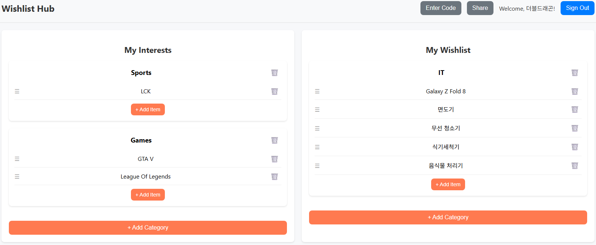

# Wishlist App

A web application designed to help users manage their personal interests and wishlists. It provides features for organizing items into categories, and the ability to share and view wishlists with others.

## Features

*   **User Authentication:** Secure user login and registration powered by Google Sign-In (Firebase Authentication).
*   **Personalized Lists:** Create and manage two distinct lists: "My Interests" and "My Wishlist".
*   **Category Management:** Organize items into custom categories within both "Interests" and "Wishlist".
*   **Item Management:** Add, update, and delete individual items within categories.
*   **Drag-and-Drop Functionality:** Easily reorder items within categories using intuitive drag-and-drop.
*   **Shared Wishlists:** View wishlists shared by other users (read-only access).
*   **Data Persistence:** All user data, including categories and items, is securely stored and synchronized using Firebase Firestore.

## Technologies Used

*   **React.js:** A JavaScript library for building user interfaces.
*   **Firebase:** Google's development platform, utilized for:
    *   **Authentication:** User authentication and management.
    *   **Firestore:** NoSQL cloud database for storing application data.
*   **@hello-pangea/dnd:** A powerful and flexible drag-and-drop library for React.
*   **CSS:** For styling and responsive design.

## Setup and Installation

To get this project up and running on your local machine, follow these steps:

### Prerequisites

*   **Node.js:** Make sure you have Node.js (which includes npm) installed. You can download it from [nodejs.org](https://nodejs.org/).

### 1. Clone the Repository

```bash
git clone https://github.com/your-username/wishlist-app.git
cd wishlist-app
```

### 2. Install Dependencies

```bash
npm install
```

### 3. Firebase Project Setup

This application relies on Firebase for authentication and data storage. You'll need to set up your own Firebase project:

1.  Go to the [Firebase Console](https://console.firebase.google.com/) and create a new project.
2.  Enable **Firestore Database** and **Authentication** (with Google Sign-in provider enabled).
3.  In your Firebase project settings, find your web app's configuration. It will look something like this:

    ```javascript
    const firebaseConfig = {
      apiKey: "YOUR_API_KEY",
      authDomain: "YOUR_AUTH_DOMAIN",
      projectId: "YOUR_PROJECT_ID",
      storageBucket: "YOUR_STORAGE_BUCKET",
      messagingSenderId: "YOUR_MESSAGING_SENDER_ID",
      appId: "YOUR_APP_ID",
      measurementId: "YOUR_MEASUREMENT_ID"
    };
    ```

4.  Create a `.env` file in the root of your project (the same directory as `package.json`) and add your Firebase configuration as environment variables:

    ```
    REACT_APP_FIREBASE_API_KEY=YOUR_API_KEY
    REACT_APP_FIREBASE_AUTH_DOMAIN=YOUR_AUTH_DOMAIN
    REACT_APP_FIREBASE_PROJECT_ID=YOUR_PROJECT_ID
    REACT_APP_FIREBASE_STORAGE_BUCKET=YOUR_STORAGE_BUCKET
    REACT_APP_FIREBASE_MESSAGING_SENDER_ID=YOUR_MESSAGING_SENDER_ID
    REACT_APP_FIREBASE_APP_ID=YOUR_APP_ID
    REACT_APP_FIREBASE_MEASUREMENT_ID=YOUR_MEASUREMENT_ID
    ```

    **Important:** Replace `YOUR_API_KEY`, `YOUR_AUTH_DOMAIN`, etc., with your actual Firebase project details. Do not commit your `.env` file to version control.

## Running the Application

Once you have completed the setup, you can run the application in development mode:

```bash
npm start
```

This will open the application in your browser at `http://localhost:3000` (or another available port).

## Deployment

This project can be deployed to various static site hosting services like Netlify, Vercel, or GitHub Pages. For GitHub Pages, you might need to configure your `package.json` with a `homepage` field and use `gh-pages` package for deployment.